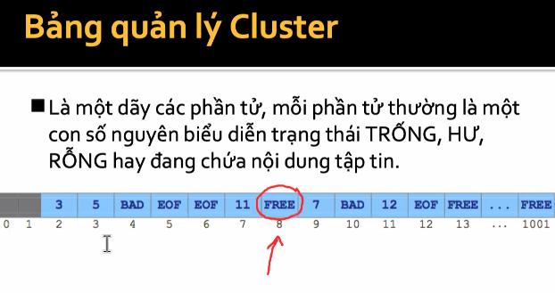

# Quản lí tập tin
- File gồm có 2 dạng: text và binary

## Đĩa từ - Cấu trúc

- HDD (hard disk drive) gồm sectors, read-write head, track.
- Gồm có nhiều đĩa, ghi data ở cả 2 mặt đĩa.
- Các khái niệm cần nhớ:
	+ Head: là 1 mặt từ trên đĩa, mặt dưới của đĩa là head thứ 2. Các head đc đánh stt từ trên xuống (bắt đầu từ 0).
	+ Cylinder: vòng tròn ở giữa đĩa, gọi là track. Mỗi mặt đều có track riêng. Tập hợp tất cả các track có cùng bán kính tạo thành trụ rỗng -> cylinder.
	+ Sectors: là 1 cung tròn trên mặt đĩa, mặc định là 512 byte/sector. 
- Mỗi head có nhiều track (vòng tròn đồng tâm), track đc đánh stt từ ngoài vào trong (bắt đầu từ 0)
- Sectors: chọn vị trí bất kì từ 1, đi theo ngược chiều kim đồng hồ.
- Địa chỉ vật lý của 1 sector: head, track, sector. Ví dụ: sector trong ảnh: head = 0, track = 0, sector = 1 => khó nhớ. 
- Nên sinh ra đchi logic của sector: xem như mảng 1 chiều. Đchi số 0 tương ứng head = 0, track = 0, sector = 1. Ví dụ trên đĩa có 18 sector: head = 0, track = 0, sector = 18.
- Sau khi chạy hết vòng tròn ở ngoài cùng, nó k nhảy vào vòng tiếp theo, mà là vòng tròn ngoài cùng của track 1.

## Thuật toán đọc đĩa
- Mỗi gói tin nằm ở 1 đchi logic nào đó. Tập tin gồm nhiều gói tin. 

### 1. First Come First Serve (FCFS)
- Phục vụ theo thứ tự yêu cầu.
- Đơn giản nhưng k đáp ứng tốt dvu.
- Ví dụ: đầu đọc hiện tại vị trí 11 | 24 8 21 7 2 14 12
	+ Di chuyển mắt đọc từ 11 -> 24 (nhiều thao tác phía dưới).
	+ 24 -> 8 ....
- Di chuyển qua 1 - tốn 1 đơn vị thời gian. Ví dụ từ 11 -> 24, tốn 13 đơn vị tg. Tổng kết quả di chuyển là chi phí để đọc 1 tệp tin với các gói tin nằm ở vị trí như đề yêu cầu.

### 2. Shortest seek time first (SSTF)
- Chọn nhu cầu gần với vị trí hiện hành nhất.
- Có nhiều yêu cầu phải chờ lâu

## 3. Scan
- Di chuyển đầu đọc về 1 phía của đĩa đến block xa nhất sau đó di chuyển về phía kia
- Còn gọi là thuật toán thang máy

## 4. C-Scan

- Di chuyển về tận cùng ở đĩa, rồi quay lại đầu, rồi lại tiếp tục.
- Ưu điểm hơn Scan: tiết kiệm thời gian hơn. 

## 5. Look và C-Look

- Dịch chuyển đến gói tin xa nhất
- Còn C-look là quay về đầu của đầu đọc. 
- Khuyết điểm: phải biết trc và tính toán đc gói tin xa nhất. Việc tìm min, max trên mảng lớn => tốn chi phí.

## Đĩa từ - Cấu trúc
- Boot Sector (sector trc bảng FAT): Boot sector | Dự phòng
- FAT 1 | FAT2 (có nhiều hoặc một): các FAT sau là backup cho FAT1.
- RDET: root directory entry table
- DATA: chứa nội dung tập tin
- Ví dụ có tập tin abc.txt; khi lưu xuống thì nó sẽ cắt abc ra thành các phần nhỏ bằng nhau (cluster) = nhiều sector liên tiếp nhau. Nội dung của tập tin đc lưu trữ trong các cluster, nằm rải rác khắp nơi. 
- các thông tin bổ trợ (tên, extension, date/time...) của tập tin lưu trong RDET, mỗi entry gồm 32 byte.
- FAT quản lý vị trí các gói tin chứa nội dung, thứ tự các gói tin.
- Boot sector: quản lý thông tin cần thiết để quản lý các vùng còn lại của partition.

### Boot Sector
- Gồm: FAT12/FAT16 và FAT32
- Các thông số quan trọng của Boot Sector dạng FAT12/FAT16:

	+ 0B: 0x0200 (viết ngược) = 512 bytes/sector.
	+ 0D: 0x10 = 16 sector/cluster
	+ 0E: 0x0001 = 1 sector
	+ 10: 0x02 = 2 bảng FAT
	+ 11: 0x0200 = 512 entry
	+ 13: 0x0000 = 0 (đọc lại offset 20) 0x000FEEC2 = 1044162 sector
	+ 16: 0x00FF = 255 sector / FAT

**Câu hỏi**
1. Tổng số sector vùng SYSTEM (trc FAT, FAT RDET)
	+ Tính sector của RDET = (512 entry x 32 byte/entry) : 512 byte/sector 
	= 32 sector
	+ Tổng số sector của SYSTEM = 1 (trc FAT) + 2 x 255 sector/FAT + 32 sector/RDET = 543

2. sector đầu tiên của vùng FAT là sector mấy? giả sử sector đầu tiên của Partition là sector 0: Vì chỉ có 1 sector trc FAT, nên đó sector 0, vậy sector đầu của FAT là sector 1.

- Sector đầu tiên của RDET: 1 (trc FAT) + 255 x 2 = 511

- Sector đầu của DATA: 543

3. Giả định cluster đầu tiên của DATA là cluster số 2, vậy sector đầu tiên cluster 5 là mấy: 543 + (5-2) x 16 sector/cluster = 591

## Entry chính
- Phân biệt Entry chính phụ: nếu gtri ở offset B là 0F thì lạ entry phụ

- Offset B là OF => entry đầu (32 byte là entry phụ)
- Entry 2 : phụ
- Entry 3: chính => xử lý trước

- 8 byte đầu là tên chính của tệp tin: k đảo ngược, ánh xạ theo mã ASCII
- 3 byte tiếp theo là phần mở rộng.
- 1 byte tiếp (0001 0000): bật 1 ở bit 4 (directory): tức là entry cho thư mục. => vì là thư mục nên 3 byte phần mở rộng là 20 (tức là khoảng trắng, k có phần mở rộng)

- 3 byte offset D là giờ tạo (ghép đảo ngược): `0xB5 F5 5C`: 1011 0101 1111 0101 0101 1100. Cắt data thành những phần tương ứng: 1011 0| 101 111 | 1 0101 01 | 01 1100

- Đổi ngược ra thập phân: 22 47 37 92: tức là đc tạo lúc 22 giờ 47p 37s 92ms
- 2 byte offset 10: ngày tạo tệp. (phần năm cộng thêm 1980): 0x83 43 -> đổi nhị phân: 0100 0011 1000 0011 (cắt thành 7 4 5) -> đổi thập phân: 1980 + 33, 12, 3
- offset 14 2 byte: Cluster bắt đầu (2 byte cao)
- offset 1a 2 byte: cluster bắt đầu (2 byte thấp)
=> ghét thấp tới cao: 07 00 00 00 =>đảo ngược: 0x00000007 = 7
- Kích thược tệp tin: 1c 4 byte: thư mục nên 00 00 00 00 tức là k chứa data thật sự.

## Entry phụ thứ 1
- Xét ngược từ entry chính: gồm entry phụ 1 và entry phụ 2.

- Entry phụ là tên dài, hoặc tên đầy đủ của entry chính

- Offset 01 độ dài 10 byte: 4E 00 65 00 77 00 20 00 46 00
- Offeset OE độ dài 12 byte: 
- 1C 4 byte: 

### Entry phụ thứ 2

- Đọc tới dấu đóng ngược: 29 còn đoạn 00 là khoảng trắng FF k đọc

## 6 dòng tiếp theo

- Có thuộc tính là gì? : 20 bật 1 ở bit 5 -> thuộc tính archive
- Tên dài (tên đầy đủ): Ext Directory Entry.tpl

- Thay E5 bằng byte để phục hồi thư mục

# 7. Cluster
- Trong vùng data: chi thành các cluster = N sector liên tiếp. Vì lưu từng sector một rất tốn chi phí.
- **cluster đầu tiên luôn đánh số 2** -> trong đề k ghi nhưng phải biết.
- Các phần cluster còn lại lưu dưới dạng là DSLK, dưới dạng FAT.
- Fat: bảng quản lý cluster.

	+ cluster 8 trong vùng DATA đang trống, có thể ghi data.
	+ cluster 4 là BAD, bị hư, k nên lưu data
	+ EOF là kết thúc file
	+ 2 -> 3 -> 5: chuỗi cluster chứa tệp tin.
- Có 3 FAT: FAT12, 16, 32 (biểu diễn số bit trong 1 phần tử)
	+ 16 bit = 2 byte: đọc 2 byte liên tiếp theo little edian.
	+ 32 bit = 4 byte: đọc 4 byte liên tiếp theo little edian.
	+ 12 bit = 1 byte rưỡi
	
- 

# 8. Data
- Nếu là file chứa data thật, còn folder thì chứa SDET.
- Dựa vào FAT để ghép cluster. trong SDET cũng cha thành 32 byte
- Đầu tiên: vô entry ráp 14 (00 00), 1A (00 07) (vị trí cluster bắt đầu): 00 00 00 07 = 7
	+ cluster 7 bắt đầu tại scetor thứ bao nhiêu? Cần biết sector có kích thước bao nhiêu? cluster 7 tức là trải qua 5 cluster (bắt đầu từ 2).
	

