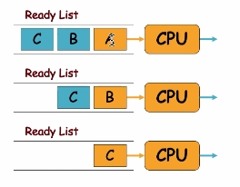
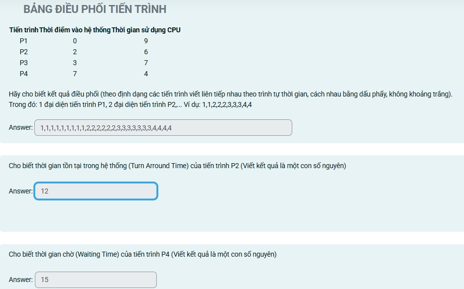

# Chương 2

## Đánh giá chiến lược điều phối
- Turn-arround time (TT) = T quit - T arrive: Từ lúc vào hệ thống đến khi hoàn tất. 
- Waiting Time (WT): T in ready list: Thời gian chờ trong ready list, k tính trong waiting list
- Xét trường hợp trung bình:

## Các chiến lược điều phối
### FIFO (FCFS)

- Độc quyền.

- Bài tập

### Xoay vòng - Round Robin
- K độc quyền

### Công việc ngắn nhất - SJF
- Có cả 2