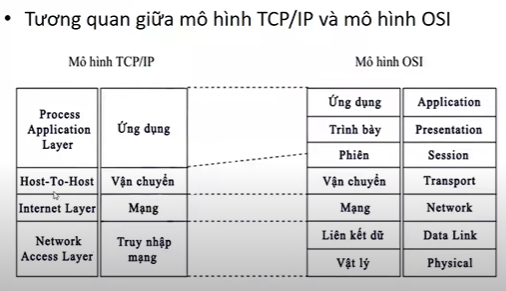

# Các Mô Hình kiến Trúc Mạng MT (Chuẩn hóa, Kiến trúc đa tầng và OSI)

## Vấn đề chuẩn hóa mạng
- Cở sở xuất hiện kiến trúc đa tầng:
- Sự khác biệt về kiến trúc mạng gây trở ngại cho việc kết nối liên mạng và khả năng mở rộng mạng
- Cần xây dựng mô hình chuẩn:
	+ Làm cơ sở cho nghiên cứu và thiết kế mạng.
	+ Tạo đk cho việc phát triển và sử dụng mạng.
- Các tổ chức tiêu chuẩn hóa mạng MT: ISO, ITU, IEEE.

## Mô hình kiến trúc đa tầng
- Phân chia các chức năng trong việc trao đổi thông tin.

- Các quy tắc phân tầng.
	+ Không quá nhiều tầng
	+ Xđich mqh giữa các tầng:
		+ Theo chiều ngang: phản ánh của hđ của các đồng tầng ở 2 thiết bị. Các đồng tầng trc khi trao đổi thông tin vs nhau phải bắt tay, hội thoại và thỏa thuận vs nhau bằng các tham số của giao thức.
		+ Theo chiều dọc: là qh giữa các tầng kề nhau trong cùng 1 thiết bị. Giao diện tầng: xác định các thao tác và các dvu tầng dưới cung cấp cho tầng trên.
	+ MQH giữa các đồng tầng -> giao thức tầng.
	+ Data k truyền theo chiều ngang.

- Lưu chuyển thông tin trong trong kiến trúc phân tầng: 
	+ encapsulation (đóng gói tin) bổ sung thêm Header.
	+ de-encapsulation (giải đóng gói) tách thông tin điều khiển đẩy lên trên.

- Nguyên tắc truyền thông đồng tầng: 
	+ Thông tin điều khiển giao thức PCI - thêm vào đầu gói tin
	+ Đơn vị data dịch vụ SDU
	+ Đơn vị data giao thức PDU

**PDU = PCI + SDU** gồm header và data

- Giao diện và dvu trong môi trường các hệ thống mở
	+ SAP (server access point): điểm truy cập dvu.
	+ mỗi một SAP có 1 nhận dạng duy nhất.

## Mô hình OSI
N = 7 tầng

- 7 - application: cung cấp giao diện, ứng dụng để end user tương tác vs các dvu mạng.

- 6 - presentation: 
	+ biểu diễn của data theo 1 dạng nhất định -> đuôi file tương ứng.
	+ encryption: mã hóa data.
	+ nén data

- 5 - session: hỗ trợ đa nhiệm, tạo các phiên làm việc cho threads.

- 4 - transport: 
	+ thiết lập kết nối end-to-end (host gửi và host nhận).
	+ reliability (độ tin cậy)

- 3 - network:
	+ routing; xác định đường đi cho gói tin từ mạng này sang mạng kia qua default gateway

- 2 - data link: định đchi MAC cho từng thiết bị, đóng gói frame theo đúng công nghệ mạng. LLC là ddkhien liên kết vs các tầng khác.

- 1 - physical: quy định các gói tin chuyển thành chuỗi bits, có bit báo hiệu bắt đầu và bit kết thúc. 

## Mô hình TCP/IP
- Gồm 2 protocol điển hình: TCP/IP, IPv4

- Các giao thức trong TCP/IP

- Application: 
	+ POP (gửi nhận thư điện tử)
	+ DNS (domain name system, phân giải tên miền)
	+ HTTP (hyptertext transfer protocol - web)
	+ FTP (file transfer protocol)
	+ SMTP (truyền thư đơn giản)
	+ TELNET (cấu hình từ xa, tuy nhiên thông tin cấu hình truyền đi ở dạng rõ -> dễ bị tấn công)
	+ SSH (secure shell -  hỗ trợ truy cập từ xa an toàn)

- Transport:
	+ TCP: an toàn hơn
	+ UDP: 

- Internet: 
	+ ARP: đóng các packet thành frame, IPv4 cần ARP
	+ ICMP: hỗ trợ IP
	+ DHCP: cấp pát đchi IP động

- Network Access:

## Phân mảnh dữ liệu
- Data đc truyền qua nhiều mạng khác nhau, kích thước cho phép khác nhau.
- Đơn vị truyền cực đại của 1 môi trường truyền: MTU (maximum transmission unit).
- Mạng nhận đc gói data có kích thước lớn hơn MTU của nó => data phân mảnh thành gói nhỏ hơn để chuyển tiếp. 
	+ gói nhỏ hơn gán thêm header để giúp quá trình nhận data đc chính xác.
	
# Bài 2 - TCP/IP một số kiến trúc mở rộng

## 1. Giao thức UDP - transport
- Là giao thức k kết nối (connectionless).
- Sử dụng cho các ứng dụng k yêu cầu độ tin cậy cao. 
- K có cơ chế xác nhận ACK, k đảm bảo chuyển giao các gói tin đến đích và theo đúng thứ tự.
- K bỏ các gói tin trùng
- Gán và quản lý port để định danh cho các ƯD

- Sử dụng 16 bit để định danh port number.

- Header UDP: Source port (16bit), Destination Port(16), Length(16), checksum(16)

## 2. Giao thức TCP - transport
- Hướng kết nối
- Cung cấp các chức năng:
	+ Thiết lập, duy trì, giải phóng liên kết 
	+ Phân phát gói tin tin cậy
	+ Tạo stt cho packet
	+ Điều khiển lỗi
	+ đa kết nối cho các quá trình khác nhau giữa thực thể nguồn - đích thông qua port number
- Đặc điểm:
	+ Ngăn sự tràn lụt, mất data
	+ Bên nhận gửi xác nhận cho bên gửi đã nhận packet
	+ IP datagram có thể đến đích k đúng thứ tự, TCP sắp xếp lại
	+ Chỉ phát lại packet lỗi
	+ Đơn vị: segment

- Sequence number: định danh gói tin
- ACK number: xác nhận 
- Code bits: bit cờ, hỗ trợ trong thiết lập kết nối

- Bài tập: Xem giáo trình tiếng anh

## 3. Giao thức điều khiển mạng ICMP
- Là gthuc dkhien của tầng internet
- Sử dụng để trao đổi các thông tin đkhiển: dòng dữ liệu, thông báo lỗi, thông tin trạng thái khác của bộ giao thức TCP/IP.
- Vì IP protocol k có cơ chế kiểm soát lỗi & và kiểm soát luồng data -> cần hỗ trợ của ICMP.

## 4. ARP và RARP
- Giao thức phân giải đchi ARP
+ Tìm đchi vật lý của trạm đích
+ Khi cần gửi 1 IP datagram cho 1 hệ thống khác trên cùng 1 mạng vật lý ethernet: cần biết đchi Ethernet của destination để tầng liên kết xdung Frame.
	+ cập nhật bảng tương ứng đhci IP-MAC
- Giao thức phân giải đchi ngược RARP: cho trc MAC, tìm IP tương ứng

- ARP gửi ARP request - broadcast tới tất cả các máy trong mạng hỏi ai có đchi IP này.
	+ Host thấy gửi lại ARP reply - trả lời tôi có ddchi này, gửi lại đchi MAC
- Tất cả các máy thu được bộ ánh xạ IP - MAC của host.
- Nếu hỏi 1 máy ngoài mạng, thì route trả lời
- RARP chỉ cấp IP. còn DHCP thì cung cấp nhiều hơn như default gateway....

## 5. Giao thức Internet - IPv4
- IPv4 và IPv6 là nòng cốt của gtiep Internet.
- Biểu diễn và phân loại đchi IPv4:
	+ 32 bit tách thành 4 octect (1byte)
	+ Viết dưới dạng thập phân có dấu chấm để phân tách giữa các octet
- Phân loại: class A,B,C,D,E
- Mục đích sử dụng: 
	+ Broadcast: định danh tất cả
	+ unicast: định danh 1 thiết bị trong mạng
	+ multicast: định danh 1 nhóm trong mạng
- Phạm vi sử dụng: public và private

**Câu hỏi tự học:**
1. Mô tả cách thức hđ của RARP, BOOTP, DHCP. So sánh ưu nhược.
2. Tìm hiểu kỹ thuật chuyển dịch đchi mạng NAT. Có mấy loại, đặc điểm từng loại.

### 5.1 Phân lớp IPv4
- Các bit đầu tiên đc dùng để định danh lớp đchi: 
	+ 0 - A
	+ 10 - B
	+ 110 - C
	+ 1110 - D
	+ 1111 - E
- A,B,C đc triển khai đặt cho các host trên mạng internet
- D: multicast
- E: mục đích nghiên cứu

- 32 bit: Net_ID và Host_ID
- Net_ID: k đc phép đồng thời = 0
- Host_ID: sử dụng để xác định phần đchi máy: vừa có 0 và 1. 
- Như vậy, đchi cho máy (hostid vừa 0 vừa 1), đchi cho mạng (hostid = 0), đchi quảng bá (hostid = 1) - đại diện tất cả các node trong mạng.

- Lớp A đchi 0 và 127 k đc dùng: 1-126
- Đchi quảng bá nội bộ: 1 máy trong mạng LAN, gửi gói tin đến tất cả các máy cùng mạng (255.255.255.255). tới router, bị hủy gói tin.
- Đchi quảng bá trực tiếp: vd máy A có đchi 192.168.20.0 vậy đchi quảng bá 192.168.20.255 (giữ Net_ID, host lật về 1) có thể gửi sang mạng khác thông qua router

- Xác định miền đchi (k gian đchi mạng): 2^n2 -2 (trừ đchi mạng và quảng bá).

- Private IP address (đchi dành riêng): k đc sử dụng cho các host trên mạng LAN.
	+ A: 10.0.0.0 - 10.255.255.255
	+ B: 178.16.0.0 - 172.31.255.255
	+ C: 192.168.0.0 - 192.168.255.255
- Hạn chế của phân lớp đchi: 
	+ Lãng phí k gian: các lớp cố định -> khó sử dụng hết dải đchi.
- Khắc phục: chia mạng con. Có 2 kỹ thuật:
	+ Subnetting
	+ Kỹ thuật VLSM
- Lợi ích mạng con:
	+ giảm gói tin quảng bá
	+ giảm nghẽn mạng

### 5.2 SUbnet Mask
- 1 mạng có thể chia thành các mạng con để dễ quản lý.
	+ lấy thêm 1 số bit đchi host để đánh đchi mạng
- Subnet mask: 32 bit, phần đchi mạng gồm toàn bit 1, đchi host gồm toàn bit 0.

