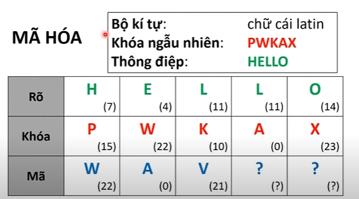

# Chapter 1 - Tổng quan

## Định nghĩa/ ký hiệu liên quan
- P - plan text: bản rõ.
- C - cipher text: bản mã.
- K - key: các khóa.
- Ek: P -> C là quy tắc mã hóa với khóa k thuộc K. Tập {Ek: k thuộc K} ký hiệu là E. Còn {Ek(x): x thuộc P}, ký hiệu là Ek(P).
- Dk: C -> P là quy tắc giải mã với khóa k thuộc K. Tập {Dk: k thuộc K} ký hiệu là D.
- Với mỗi k thuộc K sẽ được mô tả dưới dạng k = {ke, kd}, trong đó ke là khóa dùng cho mã hóa, kd là khóa dùng cho giải mã. Khi đó Ek được hiểu là hàm Eke, Dk được hiểu là Dkd.

## Định nghĩa hệ mật
- Là bộ 5 (P,C,K,E,D) thỏa mãn các điều kiện sau: 
	+ Với mọi x thuộc P, k thuộc K ta có: Dk(EK(x)) = x
	+ Mã hóa: y = Eke(x)
	+ giải mã: x = Dkd(y)

## Sơ đồ
- Bản rõ => Mã hóa => Bản mã
- Bản mã => Giải mã => Bản rõ

## Mã hóa đối xứng/ bất đối xứng
- Mã hóa đối xứng (bí mật): biết đc khóa mã dễ dàng suy đc khóa giải mã (ke = kd). 
	+ Có kênh an toàn để chuyền khóa.

- Mã hóa bất đối xứng (công khai): mỗi bên có 1 khóa công khai và bí mật. K thể suy ngược.
	+ Bên gửi dùng khóa công khai của bên nhận để mã hóa.
	+ Bên nhận dùng khóa bí mật của mình để giải mã. 

## Mã dòng 
- Hệ mật Vernam (One-time pad):
ci = mi + ki => bản mã => mi = ci - ki => bản rõ

	+ ki: nguồn khóa ngẫu nhiên, mã dòng 1 lần, k lặp lại. quyết định độ an toàn của mã.
	+ mi: nguồn tin.

