# Chương 2: Các hệ mật hiện đại

## 1. Mã khối
- **Nguyên lý thuyết kế:** có 2 nguyên tắc cơ sở để độ bảo mật cao đó là tính xáo trộn (confussion) và tính khuếch tán (diffusion)
	+ Tính xáo trộn: gây rối, xáo trộn đối với kẻ thám mã.
	+ Khuếch tán: khuếch tán những mẫu văn bản mang đặc tính thống kê lẫn vào toàn bộ văn mảng.
- Xáo trộn => phép thế, khuếch tán => đổi chỗ, hoán vị.

## 2. DES
- Input: xâu bit x có độ dài 64 bit, khóa 56 bit (từ khóa mẹ tạo ra 16 vòng khóa con có 48 bit khóa).
- Output: xâu bit mã hóa y độ dài 64 bit. 

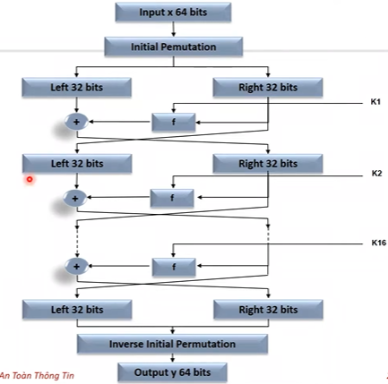

- f = k 48 bit + right 32 bit
- nửa phải là nửa trái vòng tiếp theo.
- vòng cuối: đổi ngược lại vị trí -> cho hộp hoán vị ngược -> output

- **Mô tả thuật toán**:
- Thuật toán an toàn phụ thuộc vào key, chứ k phải khóa.

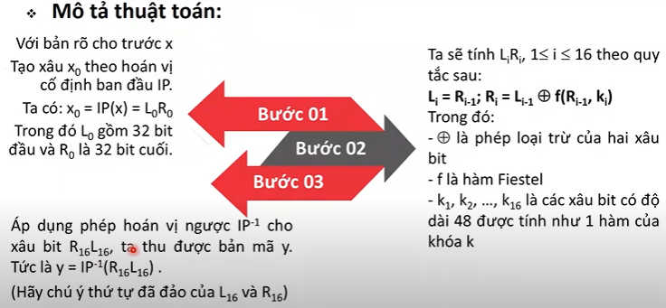

- IP: hộp hoán vị, đánh vị trí các bit, bit đầu là vị trí thứ 58 của xâu x đầu vào, tt là bit 50.... Sau khi có x0, cắt nửa L0R0.

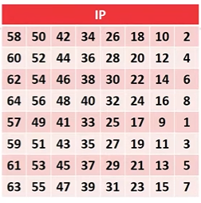

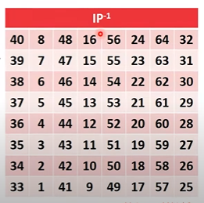

- **Hàm f**
- Input: Ri-1 (xâu A có độ dài 32 bit), ki (48 bit).
- Output: xâu 32 bit.

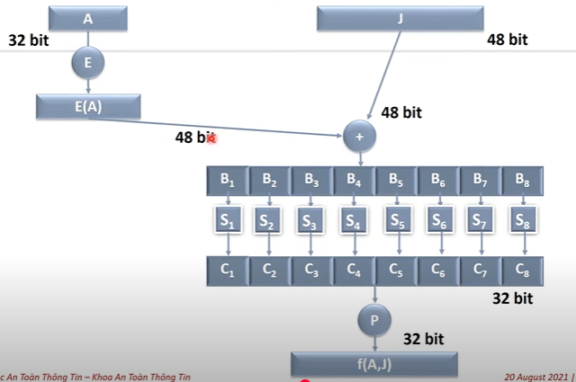

- Từ 32 bit ở đầu vào A thông qua hộp E, thu đc E(A) là 48 bit; J là key (48 bit), cộng so E(A) và J vs nhau. Chia thành 8 khối nhỏ, 6 bit. Thông qua hộp S, biến đổi thành C (4 bit), ghép lại thành 32 bit. Thông qua hộp P thành f(A,J)

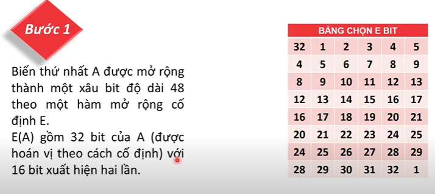

- Lặp lại 2 bit cuối nên từ 32 -> 48 bit

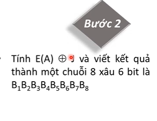

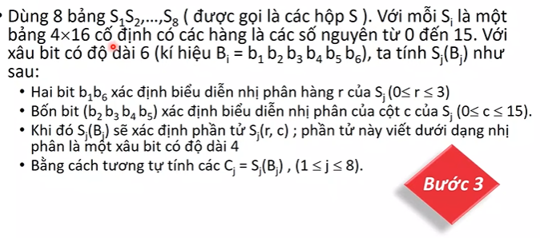

- 3 tính chất của S box:
	+ Các bit vào phụ thuộc k tuyến tính các bit ra
	+ Sửa đổi 1 bit vào làm thay đổi ít nhất 2 bit ra
	+ Khi 1 bit đc giữ cố định và 5 bit còn lại cho thay đổi thì S box thể hiện 1 tính phân bố đồng nhất. K dùng lý thuyết thống kê để phá Sbox đc

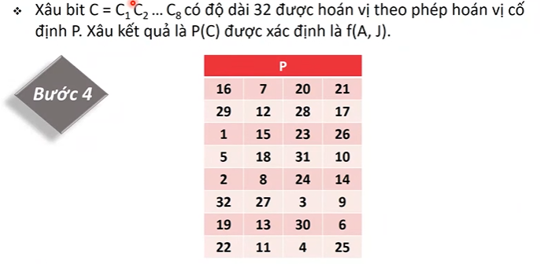 

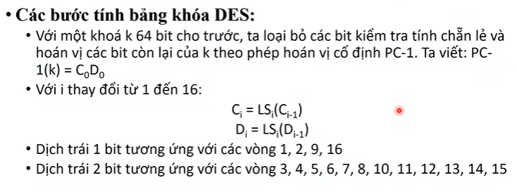

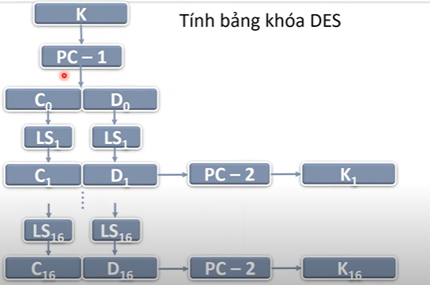

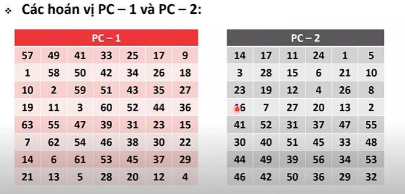

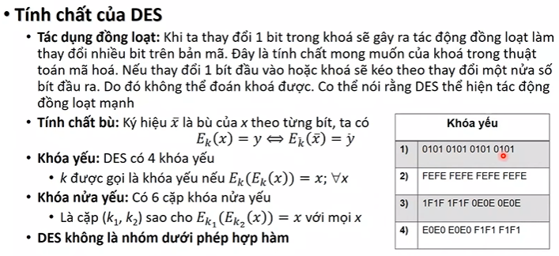

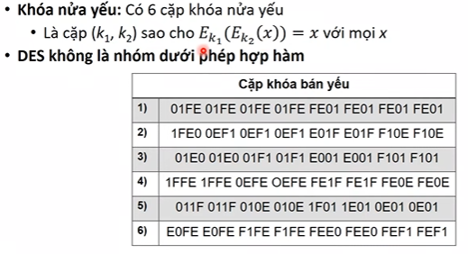