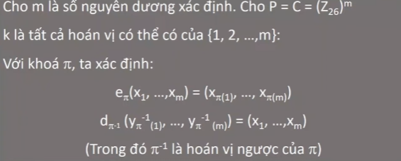
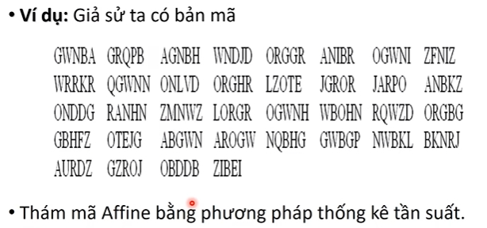

# Chương 2 - Hệ mật khóa bí mật

Nguồn khóa trong hệ truyền tin mật phải truyền trong kênh an toàn. 

## Các hệ mật cổ điển
### Các hệ mật thay thế đơn biểu
- Khi khóa đã đc chọn thì mỗi kí tự cyra bản rõ đc ánh xạ đến 1 ký tự duy nhất của bản mã
- Độ dài khóa: 26, khóa có thể có 26!

**- Mã dịch vòng (MDV - Shift cipher)**
+ P = C = K = Z26
+ y = ek(x) = x + k mod 26
+ x = dk(y) = y - k mod 26

**Bài tập**
Bản rõ: HOC TAP TOT LAO DONG TOT
Khóa k = 5

 
- Nhược điểm: Dễ đoán vì mỗi ngôn ngữ phản ánh 1 ngôn ngữ của bản rõ, ví dụ chữ cái phổ biến trong TA là chữ E

**- Mã Affine:**
+ Cho P = C = Z26, K = Z26 x Z26
	
	K = {(a,b) thuộc Z26 x Z26; UCLN (a,26) = 1}

Với k = (a,b) thuộc K ta định nghĩa:
	+ y = ek(x) = ax + b mod 26
	+ x = dk(y) = a^-1(y - b) mod 26

**Bài tập**
Cho k = (7,3). Bản rõ It is nice today

Giải mã: tính nghịch đảo.

### Các hệ mật thay thế đa biểu
- Sử dụng nhiều bảng chữ để mã -> tăng độ an toàn.
- Mỗi chữ sẽ được mã bằng bất kì chữ nào trong bản mã tùy thuộc vào ngữ cảnh khi mã hóa. Giảm tuần suất các chữ xuất hiện, mất bớt cấu trúc bản rõ.

**1. Hệ Vigenere**
- Sử dụng loạt mã Caesar khác nhau dựa trên các kí tự của 1 từ khóa.
	+ B1: Biến đổi bảng chữ cái A, B... thành các kí tự 0,1...25.
	+ B2: Key là 1 chuỗi các kí tự có độ dài m.
	+ B3: Thông điệp đc chia thành các khối có độ dài m. Mỗi lần mã hóa sẽ thực hiện biến đổi đồng thời m kí tự.  

- Số khóa: 26^m
=> Tấn công vét cạn k khả khi.

- Ví dụ: m = 6, k = cipher. Bản rõ: Information security
	+ Mã hóa bản rõ

- Bản rõ có 3 vị trí I tuy nhiên bản mã có 3 phiên bả -> giảm tuần suất, mất bớt cấu trúc bản rõ.
- O-V giống nhau, có thể do độ dài k.

**2. Hệ mật Hill**
- Lấy m tổ hợp tuyến tính của m kí tự trong 1 phần tử bản rõ để tạo ra 1 phần tử m kí tự trong 1 ptu của bản mã.

## Hệ mật thay thế k tuần hoàn
- Dùng nhiều bảng chữ cái để k nhận diện đc phân bố tuần suất.

**1. Hệ mật khóa chạy**
- Khóa đc nối tiếp bằng chính bản rõ, dùng mã Vigenere để mã.
- Khi biết từ khóa, giải đc 1 số chữ của bản rõ rồi dùng chúng giải nốt phần còn lại.
- Bài tập: key = deceptive, bản rõ: we are discovered save yourself

- Không an toàn.

**2. Hệ mật OTP**

- Độ an toàn phụ thuộc vào K.
- Nếu vét cạn thì sẽ 2^n (khó)

## Hệ mật hoán vị (MHV)
- Các chữ trong bản rõ k đc thay thế bằng chữ khác mà chỉ thay đổi vị trí giữa các chữ trong bản rõ.
- Bản mã có cùng tần xuất xuất hiện các chữ như trong bản gốc .
- Dễ thám mã.

- Bài tập:

+ Giải mã thì dùng hoán vị pi^-1.

## Hệ mật tích
- Kết hợp các hệ mật bằng cách tạo tích của chúng.

## Thám mã bằng thống kê tần suất
- Ngôn ngữ có tính dư thừa.
	+ ví dụ: tiếng anh, chữ E đc dùng nhiều nhất...
	+ các bộ thường xuất hiện: th, nt...
- Bằng PPTK, ta có thể xây dựng các bảng các tần xuất các chữ đơn, cặp, bộ ba các chữ...

- B1: xác định tuần suất xuất hiện chữ cái. So sánh vs bảng tiếng anh.

- B2: giả sử: G nhiều nhất tức chữ E (vét cạn). K đúng lại thử tiếp. Trong đoạn bản rõ quá nhỏ có thể k phản ánh đúng đặc trưng ngôn ngữ.

+ Từ bảng tần suất: G (6) là mã hóa của E (4); N(13) là mã hóa của T(19)
=> ta có hệ phương trình dựa theo cthuc của mã Affine: mã k(a,b); ek = ax + b.

=> 4a + b = 6 (mod 26)
  19a + b = 13 (mod 26)

+ lấy pt2 - pt1
(19a + b) - (4a + b) = 13 - 6
<=> 15a = 7 (mod 26)
Tính nghịch đảo theo Euclid mở rộng tìm đc a = 23, thế a vào pt1 => b = -8 = 18.

=> ek(x) = 23x + 18 mod 26
=> dk(x) = 17(y-18) = (17y + 6) mod 26

- B3: tìm bản rõ, thấy chuỗi vô nghĩa -> giả thuyết sai.
+ Giả thuyết lại G là mã hóa T, N là mã hóa E.

=> 19a + b = 6
	4a + b = 13
=> a = 3, b = 1 
=> ek(x) = 3x + 1 mod 26
=> dk(x) = 9(y-1) = 9y + 17 mod 26
 **thành công**

 - Bài tập 2:

 

 